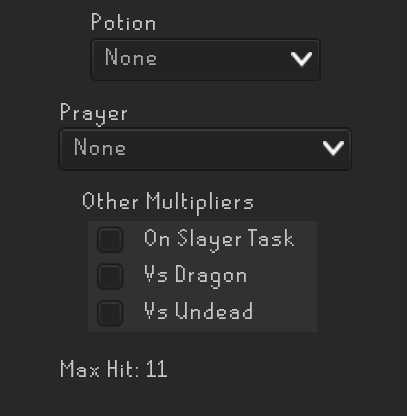

# Max Hit Calculator

Calculates your current melee max hit.

Supports identifying bonus damage from the following gear
- melee void
- salve, salve(e), salve(ei)
- slayer helm
- dragonhunter lance

You can choose which prayer and potions you'll be using.

You can configure the monster type you'll be attacking
